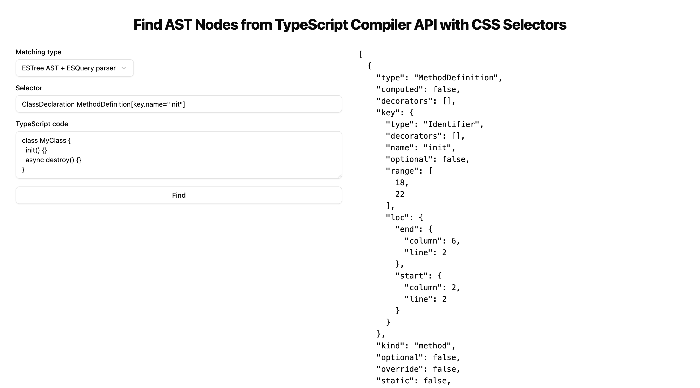

# ts-ast-selector-parser

[Демо](https://outsid3rx-ts-ast-selector-parser-e558.twc1.net)



Пример использования CSS-подобного синтаксиса для поиска узлов в TypeScript AST.
В приложении реализованы три варианта:
- С использованием библиотеки `tsquery` для поиска по AST TS Compiler API
- С использованием библиотеки `esquery` для поиска по AST ESTree (используется в ESLint)
- С использованием собственного парсера селекторов и поиска по AST TS Compiler API (для демонстрации возможностей)

## Как это работает?

### Кастомный парсер селекторов

Пакет `@cast/selector-parser` при помощи пакета `postcss-selector-parser` разбирает CSS-селекторы в набор правил, при помощи которых можно ориентироваться по AST TypeScript.

Алгоритм проходит по AST и проверяет каждый узел на соответствие правилам. Если узел соответствует всем правилам, он добавляется в результат.

`@cast/example` содержит пример использования этого пакета.

*Внимание: этот пакет в разработке - сейчас не поддерживаются многие комбинаторы и типы селекторов.*

### Парсер TSQuery

Пакет `@phenomnomnominal/tsquery` разбирает код на AST TypeScript и позволяет искать узлы при помощи CSS-подобных селекторов.

### Парсер ESQuery

Пакет `@typescript-eslint/typescript-estree` разбирает код на AST ESTree и использует пакет `esquery` для поиска узлов при помощи CSS-подобных селекторов.

## Установка

```bash
yarn install
```

## Пример использования

```ts
import { parseSelectorToPlan, querySelectorAll } from '@cast/selector-parser'

const code = `class MyClass {
  init() {}
  async destroy() {}
}`

querySelectorAll(parseSelectorToPlan(selector), code)
```